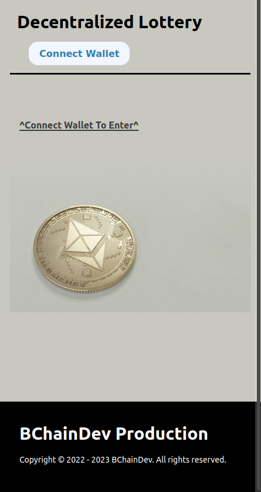

# NextJS Smartcontract Lottery/Raffle

An Ethereum Raffle

This nextjs-lottery is the front end application for my smartcontract-lottery repo. Here you can connect to your wallet and enter the Ether raffle by putting up 0.1 Ether. The raffle uses randomness from ChainLink VRF to select a winner and the winner takes the pot.  

## Motivation:
Demonstrate my ability to make a Full-Stack Web3 application

## Screenshot:

## Built with:
NextJS
Solidity
Chainlink
Moralis
web3uikit
Ethers
Hardhat
IPFS

## Installation
CD nextjs-lottery
npm run dev

## How to use?
-Connnect to your wallet of choice
-Enter Raffle
-Confirm in wallet

## Contribute:
Feel free to a fork the repo or notify me of any issues that are present

## Credit:

Part of Patrick Collins, FreeCodeCamp Course:
Lesson 9: Hardhat Smart Contract Lottery - https://www.youtube.com/watch?v=gyMwXuJrbJQ&t=49262s

License:

MIT © BChainDev
